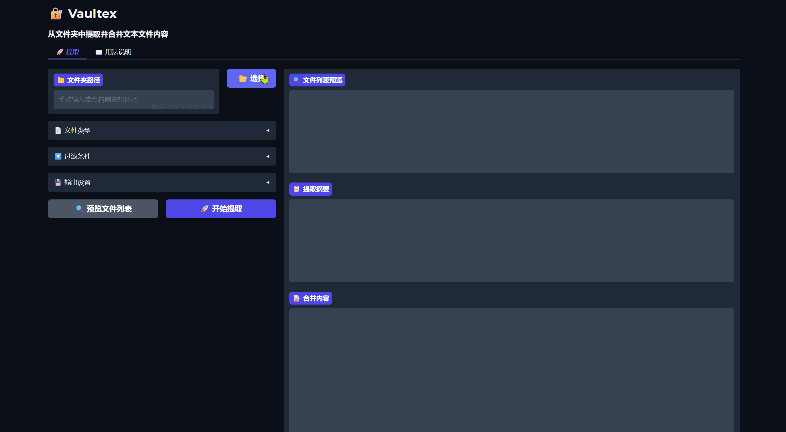

# 🔐 Vaultex

> Extract what you need. Nothing more.

Vaultex is a lightweight GUI tool that lets you **scan a folder and merge all matching files into a single text output** — ready to paste into an LLM, a doc, or anywhere you need a full-project snapshot.

The idea is simple: when you're working with a codebase or a collection of files, you often need to quickly gather *specific types* of files across nested folders. Vaultex gives you precise control over what gets included, what gets skipped, and how the result is organized — all through a clean interface.



---

## ✨ Features

- 📂 **Folder picker** — browse or paste a path directly
- 📄 **File type selector** — pick from common extensions or add your own
- 🎯 **Whitelist / blacklist filtering** — specify exactly which folders and files to include or exclude
- 📦 **File size limit** — skip files that are too large
- 🔁 **Recursive or flat mode** — go deep or stay shallow
- 🔃 **Sort options** — by path, filename, or last modified time
- 🔍 **Preview before extracting** — scan first, extract when ready
- 💾 **Save to file** — optionally write the merged output back to disk
- 🤖 **Token estimator** — rough count to check if output fits your LLM context window

---

## 🚀 Installation

```bash
pip install vaultex
```

Then launch:

```bash
vaultex
```

Or run directly from source:

```bash
git clone https://github.com/gongzhijie535-ctrl/vaultex
cd vaultex
pip install -e .
python -m vaultex
```

---

## 🖥️ Usage

1. Select a folder using the **📂 picker** or paste a path
2. Check the file types you want (`.py`, `.md`, `.json`, etc.)
3. Expand **Filter Options** to narrow down by folder or filename
4. Click **🔍 Preview** to confirm the file list
5. Click **🚀 Extract** to merge and view the output

---

## 📁 Project Structure

```
vaultex/
├── __init__.py
├── __main__.py       # entry point: python -m vaultex
├── core.py           # file collection + merging logic
└── app.py            # Gradio UI
```

---

## 📦 Requirements

- Python ≥ 3.10
- gradio

---

## 👤 Author

**Ian Gong (龚智杰)**
📧 gongzhijie535@gmail.com
🐙 [@gongzhijie535-ctrl](https://github.com/gongzhijie535-ctrl)

---

## 📄 License

MIT
